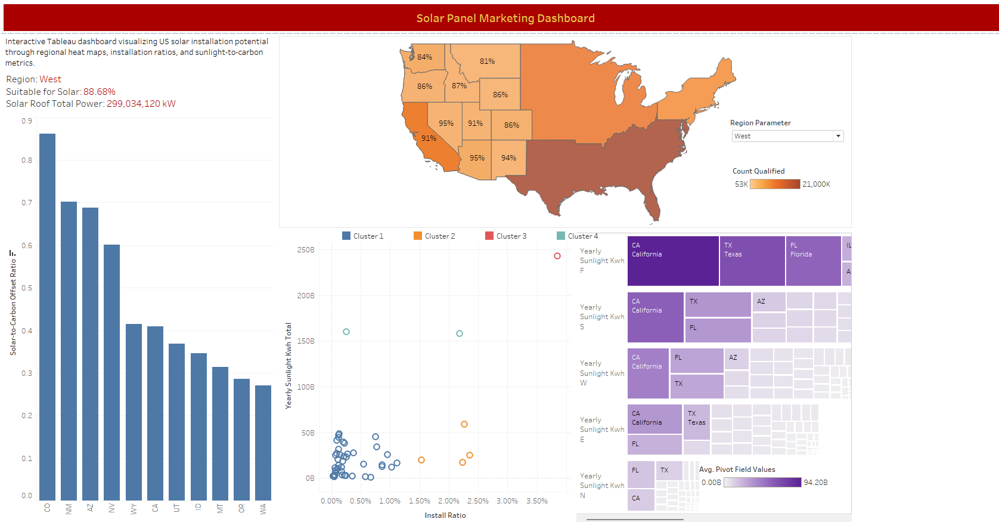

# Solar Panel Marketing Dashboard

## Overview
A Tableau dashboard for analyzing solar panel marketing performance and sales data.

## Data Source
The dashboard uses a static CSV dataset containing:
- Solar panel sales information
- Marketing metrics
- Customer geographic distribution

## Dashboard Features
- Marketing campaign performance metrics
- Sales conversion rates
- Geographic distribution of customers
- ROI analysis

## Screenshots


## Tools Used
- Tableau Desktop
- CSV data file

## How to Use
1.
```bash
git clone https://github.com/[your-username]/Solar-Panel-Marketing-Dashboard.git
```
2. Navigate to the tableau folder
3. Open the Tableau workbook (.twb file) in Tableau Desktop